# SISO Monorepo - Simplified Architecture Diagrams

## 1. Overall Monorepo Structure

```mermaid
graph TB
    subgraph SISO["🏢 SISO-MONOREPO"]
        subgraph APPS["📱 apps/"]
            CLIENT["client-base"]
            PARTNERS["partnerships"]
        end

        subgraph PACKAGES["📦 packages/"]
            DB["shared-database"]
            UI["shared-ui"]
            CONFIG["shared-config"]
        end
    end

    CLIENT --> DB
    CLIENT --> UI
    CLIENT --> CONFIG

    PARTNERS --> DB
    PARTNERS --> UI
    PARTNERS --> CONFIG

    style APPS fill:#e3f2fd,stroke:#1976d2,stroke-width:3px
    style PACKAGES fill:#fff3e0,stroke:#f57c00,stroke-width:2px
```

## 2. Client-Base Domain Architecture

## 3. Partnerships Domain Architecture

```mermaid
graph LR
    subgraph PARTNERSHIPS["🤝 partnerships/src/domains/"]
        subgraph PARTNER["partner-facing/"]
            PROJECTS["projects/"]
            BILLING["billing/"]
            ANALYTICS_P["analytics/"]
            SUPPORT["support/"]
        end

        subgraph INTERNAL["internal-admin/"]
            PARTNER_MGMT["partner-management/"]
            PLATFORM["platform-analytics/"]
            SYSTEM["system-settings/"]
            USER_MGMT["user-management/"]
        end

        subgraph SHARED_P["shared/"]
            COMP_P["components/"]
            HOOKS_P["hooks/"]
            SERVER_P["server/"]
            TYPES_P["types/"]
        end
    end

    PARTNER --> SHARED_P
    INTERNAL --> SHARED_P

    style PARTNER fill:#b2dfdb,stroke:#00796b,stroke-width:2px
    style INTERNAL fill:#ffe0b2,stroke:#ef6c00,stroke-width:2px
    style SHARED_P fill:#f8bbd0,stroke:#c2185b,stroke-width:2px
```

## 4. Domain Internal Structure (Self-Contained)

```mermaid
graph TB
    subgraph DOMAIN["📂 menu/ (Example Domain)"]
        subgraph FILES["All domain files in one place"]
            COMPONENTS["components/
            - MenuItemCard.tsx
            - MenuCategoryFilter.tsx
            - MenuSearch.tsx"]

            SECTIONS["sections/
            - MenuHeader.tsx
            - MenuGrid.tsx
            - MenuFilters.tsx"]

            HOOKS["hooks/
            - useMenuItems.ts
            - useMenuCategories.ts
            - useMenuFilters.ts"]

            SERVER["server/
            - actions.ts
            - repository.ts
            - utils.ts"]

            TYPES["types/
            - menu.types.ts
            - index.ts"]

            UTILS["utils/
            - formatPrice.ts
            - filterMenu.ts
            - searchMenu.ts"]

            PAGES["pages/
            - MenuPage.tsx
            - AdminMenuPage.tsx"]

            INDEX["index.ts
            (Public API)"]
        end
    end

    PAGES --> SECTIONS
    PAGES --> HOOKS
    SECTIONS --> COMPONENTS
    HOOKS --> SERVER
    SERVER --> TYPES
    UTILS --> TYPES
    INDEX --> PAGES
    INDEX --> HOOKS
    INDEX --> TYPES

    style DOMAIN fill:#e3f2fd,stroke:#1976d2,stroke-width:3px
    style FILES fill:#ffffff,stroke:#666,stroke-width:1px
```

## 5. Shared Packages Structure

```mermaid
graph TB
    subgraph SHARED_PKG["📦 Shared Packages (Minimal)"]
        subgraph DB_PKG["shared-database/"]
            DB_CLIENT["client/
            - supabase-client.ts
            - supabase-partners.ts"]

            DB_TYPES["types/
            - client-database.types.ts
            - partners-database.types.ts"]

            DB_UTILS["utils/
            - query-helpers.ts
            - error-handling.ts"]
        end

        subgraph UI_PKG["shared-ui/"]
            UI_PRIM["primitives/
            - Button.tsx
            - Input.tsx
            - Card.tsx
            - Modal.tsx"]

            UI_HOOKS["hooks/
            - useMediaQuery.ts
            - useDebounce.ts
            - useLocalStorage.ts"]

            UI_UTILS["utils/
            - cn.ts
            - format.ts"]
        end

        subgraph CONFIG_PKG["shared-config/"]
            CONF_ESL["eslint/"]
            CONF_TS["typescript/"]
            CONF_TW["tailwind/"]
        end
    end

    style DB_PKG fill:#e8f5e9,stroke:#388e3c,stroke-width:2px
    style UI_PKG fill:#e3f2fd,stroke:#1976d2,stroke-width:2px
    style CONFIG_PKG fill:#fce4ec,stroke:#c2185b,stroke-width:2px
```

## 6. Data Flow (Menu Domain Example)

## 7. Cross-Domain Communication

## 8. Migration Path

```mermaid
graph TB
    subgraph BEFORE["Current State"]
        OLD_CLIENT["SISO-CLIENT-BASE/
        - Flat structure
        - Mixed concerns
        - Scattered code"]

        OLD_PARTNERS["SISO-PARTNERSHIPS/
        - Flat structure
        - Duplicate code"]
    end

    subgraph PHASE1["Phase 1: Foundation"]
        SETUP["Create monorepo
        + pnpm workspaces
        + Turbo setup"]
    end

    subgraph PHASE2["Phase 2: Reorganize"]
        DOMAINS["Reorganize into domains
        + customer-facing/
        + client-facing/
        + shared/"]
    end

    subgraph PHASE3["Phase 3: Extract Shared"]
        EXTRACT["Extract shared packages
        + shared-database
        + shared-ui
        + shared-config"]
    end

    subgraph AFTER["Final State"]
        NEW_MONO["SISO-MONOREPO/
        ✅ Domain-organized
        ✅ Self-contained domains
        ✅ Minimal sharing
        ✅ Clear structure"]
    end

    BEFORE --> PHASE1
    PHASE1 --> PHASE2
    PHASE2 --> PHASE3
    PHASE3 --> AFTER

    style BEFORE fill:#ffebee,stroke:#c62828,stroke-width:2px
    style PHASE1 fill:#fff3e0,stroke:#f57c00,stroke-width:2px
    style PHASE2 fill:#e3f2fd,stroke:#1976d2,stroke-width:2px
    style PHASE3 fill:#f3e5f5,stroke:#7b1fa2,stroke-width:2px
    style AFTER fill:#e8f5e9,stroke:#388e3c,stroke-width:3px
```

## 9. Decision Flow: Where Does Code Go?

## 10. Build & Deploy Flow

---

## Key Principles Visualized

### 1. Self-Contained Domains
Each domain has everything it needs inside its folder.

### 2. Minimal Shared Packages
Only truly generic code goes into shared packages.

### 3. Clear Boundaries
Domains communicate through well-defined public APIs.

### 4. Independent Apps
Both apps share minimal code, deploy independently.

### 5. Domain-First Organization
Think "where does this feature belong" not "is this a component or a hook".

---

*These diagrams show the simplified SISO architecture focused on domain-based organization without complex templating.*
