# SISO Monorepo Architecture Diagrams

## 1. Overall Monorepo Structure

## 2. Domain-Based Architecture (Per App)

## 3. Domain Internal Structure

```mermaid
graph TB
    subgraph DOMAIN["📂 Domain (e.g., menu/)"]
        subgraph SECTIONS["sections/"]
            subgraph SEC1["menu-header/"]
                subgraph TEMPS["templates/"]
                    PRIM["primary/"]
                    T2["template-2/"]
                    T3["template-3/"]
                end

                subgraph SEC_SHARED["shared/"]
                    SEC_COMP["components/"]
                    SEC_HOOKS["hooks/"]
                    SEC_UTILS["utils/"]
                end

                TYPES_DIR["types/"]
                REGISTRY["registry.ts"]
                INDEX["index.tsx"]
            end
        end

        subgraph DOMAIN_SHARED["shared/"]
            D_TYPES["types/"]
            D_HOOKS["hooks/"]
            D_UTILS["utils/"]
            D_SERVER["server/"]
        end

        subgraph PAGES["pages/"]
            PUBLIC_PAGE["MenuPage.tsx"]
            ADMIN_PAGE["AdminMenuPage.tsx"]
        end

        PUBLIC_API["index.ts"]
    end

    INDEX --> PRIM
    INDEX --> T2
    INDEX --> T3
    INDEX --> SEC_SHARED
    INDEX --> TYPES_DIR
    INDEX --> REGISTRY

    PUBLIC_PAGE --> SECTIONS
    ADMIN_PAGE --> SECTIONS

    SECTIONS --> DOMAIN_SHARED
    PAGES --> DOMAIN_SHARED

    PUBLIC_API --> SECTIONS
    PUBLIC_API --> PAGES
    PUBLIC_API --> DOMAIN_SHARED

    style SECTIONS fill:#bbdefb,stroke:#1976d2,stroke-width:2px
    style DOMAIN_SHARED fill:#f8bbd0,stroke:#c2185b,stroke-width:2px
    style PAGES fill:#c5e1a5,stroke:#689f38,stroke-width:2px
```

## 4. Shared Packages Architecture

## 5. Template System Flow

## 6. Data Flow Architecture

## 7. Deployment Architecture

## 8. Migration Path

## 9. Component Dependency Graph

---

## Key Architecture Principles

### 1. **Separation of Concerns**
- Customer-facing domains handle public features
- Client-facing domains handle business admin
- Shared domains provide common utilities

### 2. **Template-Based Variants**
- Each section supports multiple design variants
- Variants share the same data contract
- Easy to swap without code changes

### 3. **Independent Deployments**
- Each app has its own deployment pipeline
- Shared packages published to registry
- Zero-downtime deployments

### 4. **Shared Code Reusability**
- UI components shared across all apps
- Domain models encapsulate business logic
- Services provide common functionality

### 5. **Scalable Architecture**
- Add new client apps easily
- Extract patterns to shared packages
- Template system for rapid customization

---

*These diagrams visualize the SISO monorepo architecture from multiple perspectives to aid understanding and implementation.*
